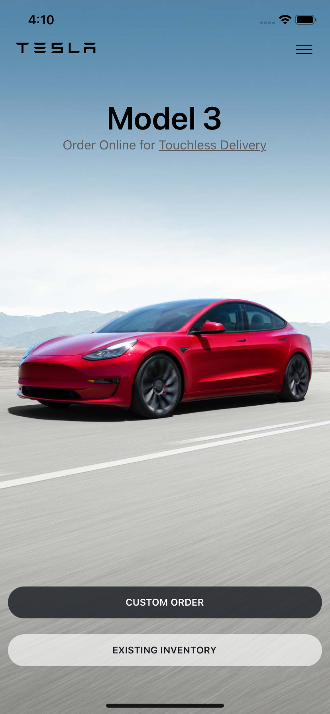
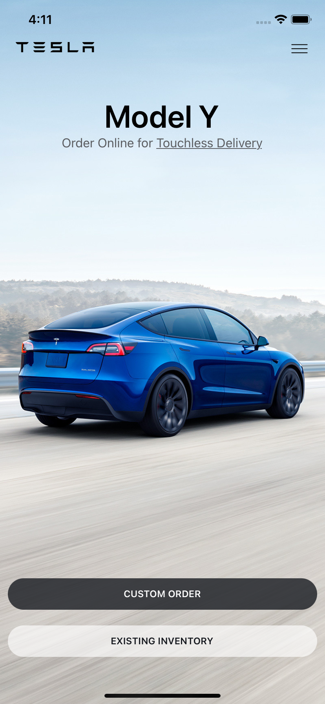

# TESLA-APP

> This project is a web application for the Tesla Front-End app using React Redux. Fully scrollable Front-End Tesla shop app.


## Built With

- HTML, CSS, Javascript.
- Webpack.
- Linters. 
- React JS. 
- React Router. 
- Redux. 
- React Reveal. 
- Jest. 
- Github Actions.

To get a local copy up and running follow these simple example steps.

## Screenshot





## Live Demo

[Live demo](https://corona-virus-pandemic.netlify.app/)


## Loom Video

Loom video- [watch](https://www.loom.com/share/b9a3779010c649cbb1c4a6c664f28c91)


### Clone this repository

To clone the repo run:
```
git clone https://github.com/ademibowale/Covid-19-tracker.git  
```
To access the cloned directory, run:
```
cd covid-19-tracker
```

## Basic Setup
### Install all dependencies

```
npm install
```

### Deployment

Run ```npm start```

## Author

👤 **Ademibowale**

- GitHub: [ademibowale](https://github.com/ademibowale)
- Twitter: [@Ademibowale]ttps://twitter.com/Ademibowale1)
- LinkedIn: [tech-adebowale-adegboye](https://www.linkedin.com/in/tech-adebowale-adegboye/)

## 🤝 Contributing

Contributions, issues, and feature requests are welcome!

Feel free to check the [issues page](https://github.com/ademibowale/Covid-19-tracker/issues).

## Show your support

Give a ⭐️ if you like this project!

## Acknowledgments

- Original design idea by [Nelson Sakwa on Behance](https://www.behance.net/sakwadesignstudio).


## 📝 License

This project is [MIT](./MIT.md) licensed.
